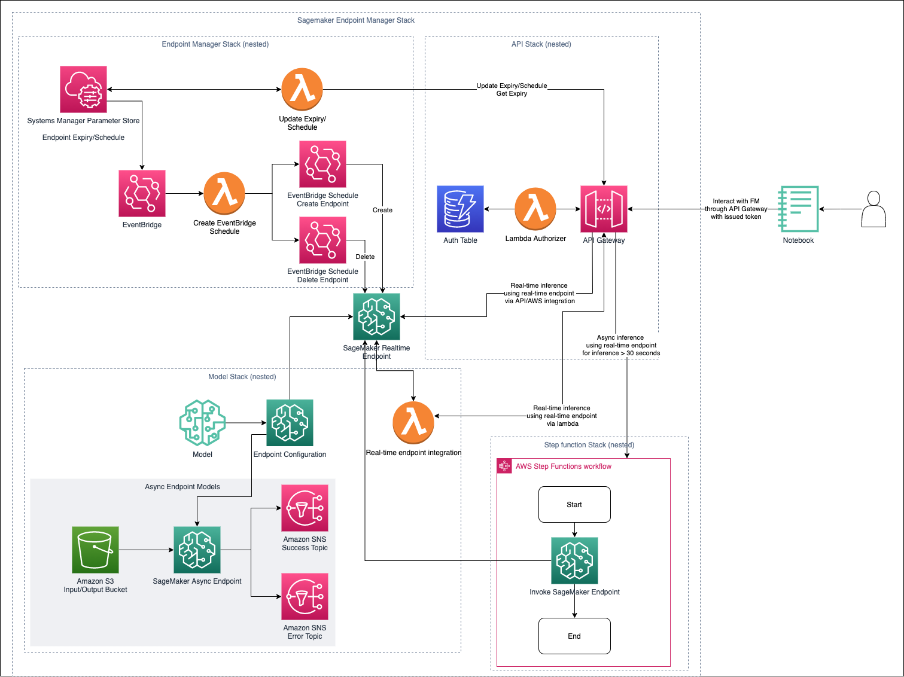

# Amazon SageMaker Endpoint Manager

A solution that will allow you to deploy Amazon SageMaker Foundation Model endpoint backed by a API Gateway/Lambda with automation to start and stop your endpoints.

The Amazon SageMaker Endpoint manager solution will allow you to expose your Amazon SageMaker foundation models through the Amazon API Gateway with a dynamodb authorizer using CDK. Amazon SageMaker Endpoint manager also features a mechanism to manage your real-time endpoint which will automatically start and stop your Amazon SageMaker endpoint through an expiry datetime configuration for each endpoint. Similar to a parking meter whereby you top up credits to ensure that your parking does not expire, in this case, you keep renewing the endpoint expiry date time to keep it running.

This solution was designed to solve a recurring problem with users leaving their Amazon SageMaker endpoint on and forgetting to delete them after usage. The approach taken to solve this in the first iteration is to enforce users to renew their endpoint expiry times based on how much time need it up for. By doing so, it raises the awareness of the cost of the endpoint (particularly for LLM endpoint) and also ensure that the user is intentional as to how time they actually need to use the endpoint for testing and development.

---
## What's New

01/08/2023
- Added support for loading jumpstart models which uses a Model Package (i.e. Marketplace subscription) instead of a Docker image
- Added the ability to send custom attributes via API Gateway/AWS integration when invoking the Amazon SageMaker endpoint by specifying the `X-Amzn-SageMaker-Custom-Attributes` in the request header.

27/07/2023
- Added lambda exception handling
- Added AWS Gateway direct AWS integration with Amazon SageMaker. To use AWS integration, set the `type` in the `integration` property to `api`.

20/07/2023
- Added support for multiple endpoints and apis in a configuration file - `config/configs.json` file.
- Consolidated realtime and async stack to simplify deployment.

---

## Table of contents
- [Amazon SageMaker Endpoint Manager](#amazon-sagemaker-endpoint-manager)
  - [What's New](#whats-new)
  - [Table of contents](#table-of-contents)
  - [Demo Overview](#demo-overview)
  - [How to deploy the stack](#how-to-deploy-the-stack)
  - [Real-time Endpoint Management Functions - Querying your real-time endpoint expiry time](#real-time-endpoint-management-functions---querying-your-real-time-endpoint-expiry-time)
  - [Real-time Endpoint Management Functions - Extending your real-time endpoint expiry time](#real-time-endpoint-management-functions---extending-your-real-time-endpoint-expiry-time)
  - [Real-time Endpoint Management Functions - Adding a new real-time endpoint](#real-time-endpoint-management-functions---adding-a-new-real-time-endpoint)
  - [Interacting with your real-time endpoint via API](#interacting-with-your-real-time-endpoint-via-api)
  - [Example Notebook](#example-notebook)
  - [Endpoint Manager Configurations](#endpoint-manager-configurations)
    - [**Jumpstart model**](#jumpstart-model)
    - [**Schedule Configuration**](#schedule-configuration)
    - [**Integration Configuration**](#integration-configuration)
    - [**Integration Properties**](#integration-properties)
  - [How does the endpoint manager work?](#how-does-the-endpoint-manager-work)
  - [To Do](#to-do)
  - [References](#references)
## Demo Overview



---

## How to deploy the stack

1. Create a python virtualenv

    ```
    $ python3 -m venv .venv
    ```

2. Activate your virtual environment

    For Mac/Linux platform:
    ```
    $ source .venv/bin/activate
    ```

    If you are a Windows platform, you would activate the virtualenv like this:

    ```
    % .venv\Scripts\activate.bat
    ```
3. Install required dependencies

    ```
    $ pip install -r requirements.txt
    ```

4. Bootstrap your environment (if required)

    If you have not previously used CDK, bootstrap your environment

    ```
    $ cdk bootstrap
    ```

5. Define your configuration

    Setup your Amazon SageMaker Endpoint Manager and configure the models that you'd like to deploy by opening the [`config/config.json`](config/configs.json) file with a text editor. Configure the project settings such as your `project_prefix`, `region_name` - region to deploy the stack and `ddb_auth_table_name`. For more information on the configuration, refer to the [Endpoint manager Configuration section](#endpoint-manager-configurations).

    Next define the jumpstart models you'd like to deploy. For more information on the jumpstart model configuration, refer to [jumpstart model configuration section](#example-jumpstart-model-configuration). Below, you can find an example of how to deploy a real-time falcon40b and flan jumpstart model. You will also find additional examples in the [`config/example-configs.json`](config/example-configs.json) file.
    
    ### Example Jumpstart model configuration

    **Falcon 40B - Realtime Endpoint configuration using apigateway/lambda integration**
    ```
        {
            "name" : "Falcon40B",
            "model_id" : "huggingface-llm-falcon-40b-instruct-bf16",
            "inference_instance_type" : "ml.g5.12xlarge",
            "inference_type": "realtime",
            "schedule": {
                "initial_provision_minutes": 90
            },
            "integration": {
                "type": "lambda",
                "properties": {
                    "lambda_src": "functions/falcon",
                    "api_resource_name": "falcon"
                }
            }
        }
    ```

    **FLAN T5 - Realtime Endpoint configuration using apigateway/lambda integration**
    ```
    {
            "name" : "FlanT5",
            "model_id" : "huggingface-text2text-flan-t5-xxl",
            "inference_instance_type" : "ml.g5.12xlarge",
            "inference_type": "realtime",
            "schedule": {
                "initial_provision_minutes": 0
            },
            "integration": {
                "type": "lambda",
                "properties": {
                    "lambda_src": "functions/flan",
                    "api_resource_name": "flan"
                }
            }
        }
    ```

    **FLAN T5 - Realtime Endpoint configuration using API Gateway/AWS Integration**
    ```
    {
            "name" : "FlanT5",
            "model_id" : "huggingface-text2text-flan-t5-xxl",
            "inference_instance_type" : "ml.g5.12xlarge",
            "inference_type": "realtime",
            "schedule": {
                "initial_provision_minutes": 0
            },
            "integration": {
                "type": "api",
                "properties": {
                    "api_resource_name": "flan"
                }
            }
        }
    ```

    **FLAT T5 - Asynchronous Endpoint configuration**
    ```
    {
            "name" : "FlanT5Async",
            "model_id" : "huggingface-text2text-flan-t5-xxl",
            "inference_instance_type" : "ml.g5.8xlarge",
            "inference_type": "async"
    }
    ```

6. Deploy the API Gateway

    First up, we will deploy the API Gateway which will provide us with an internet facing API to interact with our Amazon SageMaker Endpoint and manage our Amazon SageMaker endpoint. The API Gateway is backed by a basic lambda authorizer with the authorization tokens stored in an Amazon DynamoDB database.

     ```
     $ cdk deploy APIStack
     ```

7. Deploy the endpoint manager stack

     Deploy the lambda that will be responsible for the automatic creation and deletion of your Amazon SageMaker real-time endpoints.

     **Note:** If you are not using real-time endpoints, you do not need to deploy this start.

     ```
     $ cdk deploy EndpointManagerStack
     ```

7. Deploying your endpoints

    Finally, we will deploy our Amazon SageMaker endpoints and passthrough lambda (if configured). Note, this stack will deploy all models in the list of jumpstart models.

    ```
     $ cdk deploy ModelMeteredStack
     ```

 8.  Setup your auth

     In your AWS account, you will find a Dynamodb table `auth` which stores a token (or pass code) which you will use to as an authorization token to access the APIs. Create an item in the `auth` table with an attribute `token` and set the value to your pass code which you will use when calling the API.

 Now that you have setup your environment with a real-time endpoint, let's take a look at some of the functionality this solutions has to offer.

---
## Real-time Endpoint Management Functions - Querying your real-time endpoint expiry time

When you create your endpoint for the first time, it will initialize it with the default provision time in minutes. You can check the available time left on your endpoint by either querying a specific endpoint or get a list of endpoint.

To check the time left for a specific endpoint run the following:

```
curl --location 'https://xxxxxxxxxx.execute-api.us-east-1.amazonaws.com/prod/endpoint-expiry?EndpointName=<YOUR ENDPOINT NAME>' \
--header 'Authorization: <YOUR TOKEN VALUE>'
```

Example Request:
```
curl --location 'https://xxxxxxxxxx.execute-api.us-east-1.amazonaws.com/prod/endpoint-expiry?EndpointName=demo-Falcon40B-Endpoint' \
--header 'Authorization: <YOUR TOKEN VALUE>'
```

Example Response:
```
{
    "EndpointName": "demo-Falcon40B-Endpoint",
    "EndpointExpiry ": "22-06-2023-08-24-12",
    "TimeLeft": "00:00:10.21130"
}
```

To check the time left for all endpoints configured, run the following:
```
curl --location 'https://xxxxxxxxxx.execute-api.us-east-1.amazonaws.com/prod/endpoint-expiry' \
--header 'Authorization: <YOUR TOKEN VALUE>'
```

Example Response
```
[
    {
        "EndpointName": "demo-Falcon40B-Endpoint",
        "EndpointExpiry ": "26-06-2023-12-39-47",
        "TimeLeft": "0:24:05.157431"
    },
    {
        "EndpointName": "another-ml-Endpoint",
        "EndpointExpiry ": "26-06-2023-13-15-27",
        "TimeLeft": "0:59:45.157396"
    }
]
```
---
## Real-time Endpoint Management Functions - Extending your real-time endpoint expiry time

To extend the amount of time your endpoint will be kept alive, run the following:

```
curl --location 'https://xxxxxxxxxx.execute-api.us-east-1.amazonaws.com/prod/endpoint-expiry' \
--header 'Authorization: <YOUR TOKEN VALUE>' \
--header 'Content-Type: application/json' \
--data '{
    "EndpointName": "<YOUR ENDPOINT NAME>",
    "minutes": <AMOUNT OF TIME TO EXTEND YOUR ENDPOINT>
}'
```

The following example request will extend the endpoint uptime by 10 minutes:
```
curl --location 'https://xxxxxxxxxx.execute-api.us-east-1.amazonaws.com/prod/endpoint-expiry' \
--header 'Authorization: <YOUR TOKEN VALUE>' \
--header 'Content-Type: application/json' \
--data '{
    "EndpointName": "demo-Falcon40B-Endpoint",
    "minutes": 10
}'
```

Expected Response:
```
{
    "EndpointName": "demo-Falcon40B-Endpoint",
    "EndpointExpiry ": "26-06-2023-12-39-47",
    "TimeLeft": "0:30:46.596924"
}
```
---

## Real-time Endpoint Management Functions - Adding a new real-time endpoint

With the endpoint management API, you can add a new real-time endpoint with pre-existing Amazon SageMaker endpoint configurations. 

**Note:** You can use the endpoint manager for any model regardless if it is jumpstart or not.

Run the following API call to create a new real-time endpoint:

```
curl --location 'https://xxxxxxxxxx.execute-api.us-east-1.amazonaws.com/prod/endpoint-expiry' \
--header 'Authorization: <YOUR TOKEN VALUE>' \
--header 'Content-Type: application/json' \
--data '{
    "EndpointName": "<YOUR ENDPOINT NAME>",
    "EndpointConfigName": "<YOUR ENDPOINT CONFIGURATION NAME>",
    "minutes": <PROVISION TIME IN MINUTES>
}'
```

The following API call will create a new endpoint with the name `test-inpainting-Endpoint` using the endpoint configuration `jumpstart-example-model-inpainting-cfg` with an initial uptime of 30 minutes.
```
curl --location 'https://xxxxxxxxxx.execute-api.us-east-1.amazonaws.com/prod/endpoint-expiry' \
--header 'Authorization: <YOUR TOKEN VALUE>' \
--header 'Content-Type: application/json' \
--data '{
    "EndpointName": "test-inpainting-Endpoint",
    "EndpointConfigName": "jumpstart-example-model-inpainting-cfg",
    "minutes": 30
}'
```

Example Response:
```
{
    "EndpointName": "test-inpainting-Endpoint",
    "EndpointExpiry ": "26-06-2023-13-15-27",
    "TimeLeft": 30
}
```

---
## Interacting with your real-time endpoint via API
With the deploy API Gateway and model lambda, you can interact with your Amazon SageMaker endpoint through the internet. Below are examples of how you can interact with the falcon and flan api.

**Falcon API**

Sample request to interact with the **Falcon API**:
```
curl --location 'https://xxxxxxxxxx.execute-api.us-east-1.amazonaws.com/prod/falcon' \
--header 'Authorization: <YOUR TOKEN VALUE>' \
--header 'Content-Type: application/json' \
--data '{
    "inputs": "Write a program to compute factorial in python:",
    "parameters": {"max_new_tokens": 200}
}'
```

Sample Response:
```
[
    {
        "generated_text": "\nYou can compute factorial in Python using the built-in function `math.factorial()`. Here's an example:\n\n```python\nimport math\n\nn = 5\nfactorial = math.factorial(n)\nprint(factorial)\n```\n\nThis will output `120`, which is the factorial of 5."
    }
]
```
**Flan API**

Sample request to interact with the **Flan API**:

```
curl --location 'https://xxxxxxxxxx.execute-api.us-east-1.amazonaws.com/prod/flan' \
--header 'Authorization: <YOUR TOKEN VALUE>' \
--header 'Content-Type: application/json' \
--data '{
    "text_inputs":"write a story about beautiful weather on a topical island.", 
    "max_length": 50, 
    "temperature": 0.0,
    "seed": 321
}'
```

Expected response
```
{
    "generated_texts": [
        "..."
    ]
}
```

---
## Example Notebook

You can also interact with the API gateway via notebook. To do so, clone this repository or copy `00-api_gateway_managed_endpoint.ipynb` to your notebook environment (i.e. Amazon SageMaker Studio) and run through the instructions in the notebook.

The notebook will show you how to manage your endpoint, interact with your SageMaker endpoint API And how to use Langchain with APIGateway.

---

## Endpoint Manager Configurations
Endpoint manager configurations:
- `project_prefix`
  - Description: Project prefix name to use for all resources
  - Type: String
  - Required: Yes
- `region_name`
  - Description: AWS region to deploy the CDK solution and endpoint
  - Type: String
  - Example values: `us-east-1` | `us-west-1`
- `ddb_auth_table_name`
  - Description: Name of the dynamodb table to store your auth token for your API Gateway
  - Type: String
- `jumpstart_models`
  - Description: List of jumpstart models configurations 
  - Type: Array of [Jumpstart model](#jumpstart-model)

### **Jumpstart model**
Jumpstart model configurations
  - `name`
    - Description: Name of model
    - Type: String
    - Required: Yes
  - `model_id`
    - Description: Jumpstart model ID (A list of model id can be found [here](https://sagemaker.readthedocs.io/en/stable/doc_utils/pretrainedmodels.html))
    - Type: String
    - Required: Yes
  - `inference_instance_type`
    - Description: Size of the instance type to use
    - Type: String
    - Required: Yes
  - `inference_type`
    - Description: Type of inference endpoint to be deployed - Real-time or asynchronous
    - Type: String
    - Required: Yes
    - Valid Options: `realtime` | `async`
  - `schedule`
    - Description: Schedule configuration for the endpoint
    - Type: [Schedule Configuration](#schedule-config) object
  - `integration`
    - Description: Endpoint integration configurations.
    - Type: [Integration](#integration-configuration) object.


### **Schedule Configuration**
SageMaker Endpoint Schedule configuration (Currently supports expiring endpoints).
- `initial_provision_minutes`
    - Description: Initial time the endpoint will be provisioned for when the CDK stack is deployed in minutes.
    - Type: Integer


### **Integration Configuration**
Endpoint integration configurations
- `type`
    - Description: Indicates the type of API Gateway integration with the endpoint. If using lambda integration, ensure that you specify the `lambda_src` configuration in the integration properties.
    - Type: String
    - Required: Yes
    - Valid Options: `lambda` | `api`
- `properties`
    - Description: Integration properties
    - Type: [Integration Properties](#integration-properties)

### **Integration Properties**
Integration specific configurations
- `lambda_src`
    - Description: Path to the lambda handler for the API Gateway/Endpoint integration.
    - Type: String
    - Required: Yes for lambda integration type.
- `api_resource_name`
    - Description: API gateway resource name. For example, setting it to `falcon` will result in the API gateway path as `https://<api_gateway_id>.execute-api.us-east-1.amazonaws.com/prod/falcon`
    - Type: String
    - Required: Yes

---
## How does the endpoint manager work?

1. When the stack is provisioned for the first time, the user defined the initial required endpoint provision time in minutes (`initial_provision_time_minutes`) in the `app.py`
2. Once provisioned, a start/stop lambda will poll a list of Amazon SageMaker Parameter store parameter with the prefix `/sagemaker/endpoint/expiry/*` to check the expiry date/time for each endpoint. If the date/time is not expired and an endpoint has not been created, the lambda will create the model endpoint.
3. If the expiry datetime is less than the current time, the lambda will automatically delete the endpoint.
4. Users can check the time left on their endpoint by querying the `endpoint-expiry` API. For more information refer to [Real-time Endpoint Management Functions - Querying your real-time endpoint expiry time](#real-time-endpoint-management-functions---querying-your-real-time-endpoint-expiry-time).
5. Users can also extend the endpoint uptime by sending a request to the `endpoint-expiry` API by providing the time in minutes the request body. For more information, refer to [Real-time Endpoint Management Functions - Extending your real-time endpoint expiry](#real-time-endpoint-management-functions---extending-your-real-time-endpoint-expiry-time).
6. You can also add a new endpoint to be managed by the endpoint manager for pre-existing Amazon SageMaker endpoint configurations. For more information, refer to [Real-time Endpoint Management Functions - Adding a new real-time endpoint](#real-time-endpoint-management-functions---adding-a-new-real-time-endpoint).
---
## To Do 
- [x] Bug - if time is expired, extending the time will need to be greater than the different of current time + time required. Will need to add a check to see if time is expired, add time from now + time required. 
- [x] Add support for multiple endpoints
- [x] Add support for managing existing endpoints
- [x] Add support for adding new endpoints via API
- [x] Improve lambda error handling
- [x] Add API gateway/AWS integration
- [ ] Add support for scheduled endpoints (i.e. M-F 9-5)
- [ ] Add support for cognito users
- [ ] Add support for expiry notifications
- [ ] Add UI to manage endpoint expiry
- [ ] Automatic shutdown of endpoint based on endpoint activity (i.e. <X% of usage)
- [ ] Add configuration to use pre-defined dynamodb auth table or create new dynamodb table.
- [ ] Extend async solution with lambda

## References

Building an API Gateway with CDK - https://docs.aws.amazon.com/cdk/api/v2/python/aws_cdk.aws_apigateway/README.html#lambda-based-request-authorizer

